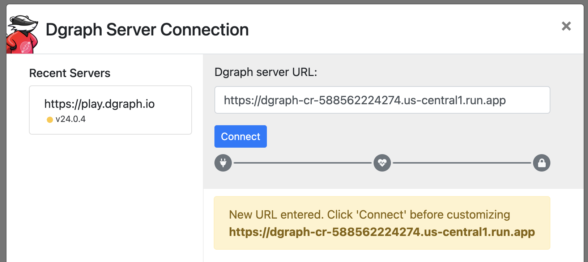
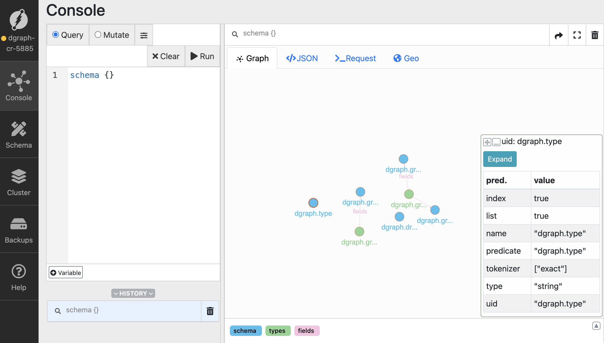

# Deploying Dgraph on Google Cloud Run

This guide walks you through deploying Dgraph, a distributed graph database, on Google Cloud Run.

## Prerequisites

- Google Cloud Platform account with billing enabled
- Google Cloud SDK (`gcloud`) installed and configured
- Docker installed locally

## Architecture Overview

Dgraph consists of three main components:
- **Alpha nodes**: Store and serve data
- **Zero nodes**: Manage cluster metadata and coordinate transactions
- **Ratel**: Web UI for database administration (optional)

This example uses the Dgraph standalone Docker image which includes both the alpha and zero nodes in a single container.

## Step 1: Project Setup

First, set up your Google Cloud project and enable necessary APIs:

```bash
# Set your project ID
export PROJECT_ID="your-project-id"
gcloud config set project $PROJECT_ID

# Enable required APIs
gcloud services enable run.googleapis.com
gcloud services enable containerregistry.googleapis.com
gcloud services enable cloudbuild.googleapis.com
gcloud services enable file.googleapis.com
gcloud services enable vpcaccess.googleapis.com
```

Create a Filestore instance for persistent data:

```bash
gcloud filestore instances create dgraph-data \
  --zone=us-central1-a \
  --tier=BASIC_HDD \
  --file-share=name=dgraph,capacity=1GB \
  --network=name=default
```

Create VPC connector for private network access (this is required for the Filestore volume)

```bash
# Create VPC connector for private network access
gcloud compute networks vpc-access connectors create dgraph-connector \
  --network default \
  --region us-central1 \
  --range 10.8.0.0/28 \
  --min-instances 2 \
  --max-instances 3
```

## Step 2: Create Dgraph Configuration

Create a directory for your Dgraph deployment:

```bash
mkdir dgraph-cloudrun
cd dgraph-cloudrun
```

Create a `Dockerfile`:

```dockerfile
FROM dgraph/standalone:latest

# Create directories for data and config
RUN mkdir -p /dgraph/data /dgraph/config

# Copy configuration files
COPY dgraph-config.yml /dgraph/config

# Set working directory
WORKDIR /dgraph

# Expose the Dgraph ports
EXPOSE 8080 9080 8000

# Start Dgraph in standalone mode
ADD start.sh /
RUN chmod +x /start.sh

CMD ["/start.sh"]
```

Create `dgraph-config.yml`:

```yaml
# Dgraph configuration for standalone deployment

datadir: /dgraph/data
bindall: true

# HTTP & GRPC ports
port_offset: 0
grpc_port: 9080
http_port: 8080

# Alpha configuration
alpha:
  lru_mb: 1024

# Security settings (adjust as needed)
whitelist: 0.0.0.0/0

# Logging
logtostderr: true
v: 2

# Performance tuning for cloud deployment
badger:
  compression: snappy
  numgoroutines: 8
```

Create `start.sh`:

```bash
#!/bin/bash

# Start Dgraph Zero
dgraph zero --tls use-system-ca=true --config /dgraph/config/dgraph-config.yml &

# Start Dgraph Alpha
dgraph alpha --tls use-system-ca=true --config /dgraph/config/dgraph-config.yml &

# Wait for all processes to finish
wait
```

## Step 3: Build and Push Container Image

Build your Docker image and push it to Google Container Registry.

You'll first need to authorize `docker` to use the `gcloud` credentials:

```bash
gcloud auth configure-docker
```


> Note the use of `--platform linux/amd64` flag, this is important when building the image on an Apple Silicon Mac.

```bash
# Build the image
docker build --platform linux/amd64 -t gcr.io/$PROJECT_ID/dgraph-cr .
```


Push the container to Google Container Registry

```bash
# Push to Google Container Registry
docker push gcr.io/$PROJECT_ID/dgraph-cr
```

## Step 4: Deploy to Cloud Run

Deploy Dgraph Alpha to Cloud Run:

```bash
gcloud run deploy dgraph-cr \                                          
  --image gcr.io/($PROJECT_ID)/dgraph-cr \
  --platform managed \
  --region us-central1 \
  --allow-unauthenticated \
  --memory 4Gi \
  --cpu 2 \
  --vpc-connector dgraph-connector \
  --add-volume name=dgraph-storage,type=nfs,location=$FILESTORE_IP:/dgraph \
  --add-volume-mount volume=dgraph-storage,mount-path=/dgraph/data
```


Our Dgraph instance is now available at `https://dgraph-cr-<REVISION_ID>.us-central1.run.app`

> Note that we are binding Dgraph's HTTP port 8080 to port 80

Verify deployment:

```
curl https://dgraph-cr-588562224274.us-central1.run.app/health

-----
[{"instance":"alpha","address":"localhost:7080","status":"healthy","group":"1","version":"v24.1.4","uptime":1258,"lastEcho":1756412281,"ongoing":["opRollup"],"ee_features":["backup_restore","cdc"],"max_assigned":8}]%
```


> Ratel web UI can be run locally using `docker run -it -p 8000:8000 dgraph/ratel:latest`





## Optional Configurations

### Set up IAM and Security

Create a service account for Dgraph:

```bash
gcloud iam service-accounts create dgraph-service-account

gcloud projects add-iam-policy-binding $PROJECT_ID \
  --member="serviceAccount:dgraph-service-account@$PROJECT_ID.iam.gserviceaccount.com" \
  --role="roles/storage.admin"
```

## Step 7: Configure Health Checks

Create a health check endpoint by modifying your container to include a health check script:

```bash
# Add to your Dockerfile
COPY healthcheck.sh /usr/local/bin/
RUN chmod +x /usr/local/bin/healthcheck.sh
HEALTHCHECK --interval=30s --timeout=10s --start-period=40s --retries=3 \
  CMD /usr/local/bin/healthcheck.sh
```

Create `healthcheck.sh`:

```bash
#!/bin/bash
curl -f http://localhost:8080/health || exit 1
```

## Step 8: Testing Your Deployment

Once deployed, test your Dgraph instance:

```bash
# Get the Cloud Run service URL
SERVICE_URL=$(gcloud run services describe dgraph-cr --platform managed --region us-central1 --format 'value(status.url)')

# Test the health endpoint
curl $SERVICE_URL/health
```

## Step 10: Set Up Monitoring and Logging

Enable Cloud Monitoring for your Cloud Run service:

```bash
# Create an alert policy
gcloud alpha monitoring policies create --policy-from-file=alert-policy.yaml
```

Create `alert-policy.yaml`:

```yaml
displayName: "Dgraph High Memory Usage"
conditions:
  - displayName: "Memory utilization"
    conditionThreshold:
      filter: 'resource.type="cloud_run_revision" resource.label.service_name="dgraph-alpha"'
      comparison: COMPARISON_GT
      thresholdValue: 0.8
```


### Multi-Region Deployment

For high availability, deploy across multiple regions:

```bash
# Deploy to multiple regions
for region in us-central1 us-east1 europe-west1; do
  gcloud run deploy dgraph-rc-$region \
    --image gcr.io/$PROJECT_ID/dgraph-alpha \
    --platform managed \
    --region $region \
    --allow-unauthenticated
done
```

## Troubleshooting

Common issues and solutions:

1. **Container startup fails**: Check logs with `gcloud run services logs read dgraph-alpha`
2. **Memory issues**: Increase memory allocation or optimize queries
3. **Network connectivity**: Verify VPC connector configuration
4. **Data persistence**: Ensure proper volume mounting and permissions
