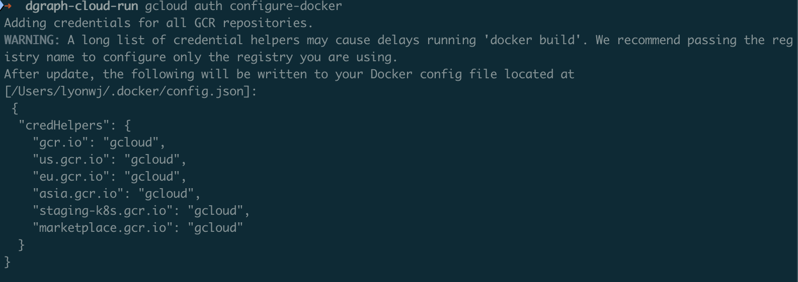
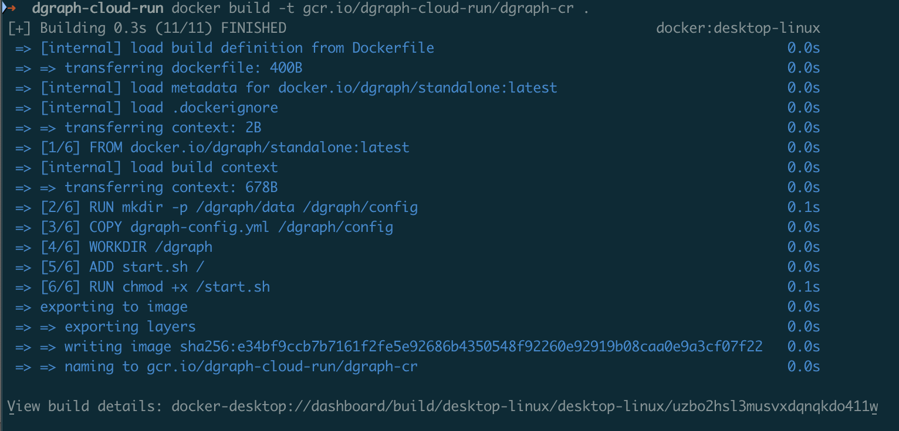
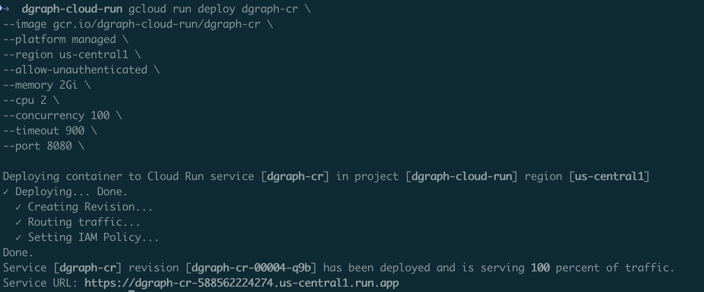

# Deploying Dgraph on Google Cloud Run

This guide walks you through deploying Dgraph, a distributed graph database, on Google Cloud Run. Cloud Run is ideal for Dgraph because it provides serverless scaling, built-in load balancing, and simplified container deployment.

## Prerequisites

- Google Cloud Platform account with billing enabled
- Google Cloud SDK (`gcloud`) installed and configured
- Docker installed locally

## Architecture Overview

Dgraph consists of three main components:
- **Alpha nodes**: Store and serve data
- **Zero nodes**: Manage cluster metadata and coordinate transactions
- **Ratel**: Web UI for database administration (optional)

For Cloud Run deployment, we'll focus on Alpha nodes since Zero nodes are primarily needed for multi-node clusters.

## Step 1: Project Setup

First, set up your Google Cloud project and enable necessary APIs:

```bash
# Set your project ID
export PROJECT_ID="your-project-id"
gcloud config set project $PROJECT_ID

# Enable required APIs
gcloud services enable run.googleapis.com
gcloud services enable containerregistry.googleapis.com
gcloud services enable cloudbuild.googleapis.com
```

## Step 2: Create Dgraph Configuration

Create a directory for your Dgraph deployment:

```bash
mkdir dgraph-cloudrun
cd dgraph-cloudrun
```

Create a `Dockerfile`:

```dockerfile
FROM dgraph/standalone:latest

# Create directories for data and config
RUN mkdir -p /dgraph/data /dgraph/config

# Copy configuration files
COPY dgraph-config.yml /dgraph/config

# Set working directory
WORKDIR /dgraph

# Expose the Dgraph ports
EXPOSE 8080 9080 8000

# Start Dgraph in standalone mode
ADD start.sh /
RUN chmod +x /start.sh

CMD ["/start.sh"]
```

Create `dgraph-config.yml`:

```yaml
# Dgraph configuration for standalone deployment

datadir: /dgraph/data
bindall: true

# HTTP & GRPC ports
port_offset: 0
grpc_port: 9080
http_port: 8080

# Alpha configuration
alpha:
  lru_mb: 1024

# Security settings (adjust as needed)
whitelist: 0.0.0.0/0

# Logging
logtostderr: true
v: 2

# Performance tuning for cloud deployment
badger:
  compression: snappy
  numgoroutines: 8
```

Create `start.sh`:

```bash
#!/bin/bash

# Start Dgraph Zero
dgraph zero --config /dgraph/config/dgraph-config.yml &

# Start Dgraph Alpha
dgraph alpha --config /dgraph/config/dgraph-config.yml &

# Wait for all processes to finish
wait
```

## Step 3: Build and Push Container Image

Build your Docker image and push it to Google Container Registry.

You'll first need to authorize `docker` to use the `gcloud` credentials:

```bash
gcloud auth configure-docker
```



> Note the use of `--platform linux/amd64` flag, this is important when building the image on an Apple Silicon Mac.

```bash
# Build the image
docker build --platform linux/amd64 -t gcr.io/$PROJECT_ID/dgraph-cr .
```




Push the container to Google Container Registry

```bash
# Push to Google Container Registry
docker push gcr.io/$PROJECT_ID/dgraph-cr
```

## Step 4: Deploy to Cloud Run

Deploy Dgraph Alpha to Cloud Run:

```bash
gcloud run deploy dgraph-cr \
  --image gcr.io/$PROJECT_ID/dgraph-cr \
  --platform managed \
  --region us-central1 \
  --allow-unauthenticated \
  --memory 2Gi \
  --cpu 2 \
  --concurrency 100 \
  --timeout 900 \
  --port 8080
```



## Step 5: Configure Persistent Storage

Since Cloud Run is stateless, you'll need persistent storage for your data. Use Google Cloud Storage or Cloud SQL:

### Option A: Cloud Storage (Recommended for backups)

Create a Cloud Storage bucket:

```bash
gsutil mb gs://$PROJECT_ID-dgraph-backups
```

### Option B: Cloud Filestore (For persistent data)

Create a Filestore instance:

```bash
gcloud filestore instances create dgraph-data \
  --zone=us-central1-a \
  --tier=BASIC_HDD \
  --file-share=name=dgraph,capacity=1TB \
  --network=name=default
```

Update your Dockerfile to mount the Filestore:

```dockerfile
FROM dgraph/dgraph:latest

# Mount point for Filestore
VOLUME ["/dgraph/data"]

EXPOSE 8080 9080

CMD ["dgraph", "alpha", "--postings=/dgraph/data/p", "--wal=/dgraph/data/w", "--my=0.0.0.0:7080", "--zero=0.0.0.0:5080"]
```

## Step 6: Set Up Networking and Security

### Configure VPC Connector (if using Filestore)

```bash
gcloud compute networks vpc-access connectors create dgraph-connector \
  --network default \
  --region us-central1 \
  --range 10.8.0.0/28
```

Deploy with VPC connector:

```bash
gcloud run deploy dgraph-alpha \
  --image gcr.io/$PROJECT_ID/dgraph-alpha \
  --platform managed \
  --region us-central1 \
  --vpc-connector dgraph-connector \
  --memory 2Gi \
  --cpu 2
```

### Set up IAM and Security

Create a service account for Dgraph:

```bash
gcloud iam service-accounts create dgraph-service-account

gcloud projects add-iam-policy-binding $PROJECT_ID \
  --member="serviceAccount:dgraph-service-account@$PROJECT_ID.iam.gserviceaccount.com" \
  --role="roles/storage.admin"
```

## Step 7: Configure Health Checks

Create a health check endpoint by modifying your container to include a health check script:

```bash
# Add to your Dockerfile
COPY healthcheck.sh /usr/local/bin/
RUN chmod +x /usr/local/bin/healthcheck.sh
HEALTHCHECK --interval=30s --timeout=10s --start-period=40s --retries=3 \
  CMD /usr/local/bin/healthcheck.sh
```

Create `healthcheck.sh`:

```bash
#!/bin/bash
curl -f http://localhost:8080/health || exit 1
```

## Step 8: Testing Your Deployment

Once deployed, test your Dgraph instance:

```bash
# Get the Cloud Run service URL
SERVICE_URL=$(gcloud run services describe dgraph-alpha --platform managed --region us-central1 --format 'value(status.url)')

# Test the health endpoint
curl $SERVICE_URL/health

# Test a simple GraphQL query
curl -X POST $SERVICE_URL/query -H "Content-Type: application/json" -d '{"query": "{ __schema { types { name } } }"}'
```

## Step 10: Set Up Monitoring and Logging

Enable Cloud Monitoring for your Cloud Run service:

```bash
# Create an alert policy
gcloud alpha monitoring policies create --policy-from-file=alert-policy.yaml
```

Create `alert-policy.yaml`:

```yaml
displayName: "Dgraph High Memory Usage"
conditions:
  - displayName: "Memory utilization"
    conditionThreshold:
      filter: 'resource.type="cloud_run_revision" resource.label.service_name="dgraph-alpha"'
      comparison: COMPARISON_GT
      thresholdValue: 0.8
```

## Production Considerations

### Scaling and Performance

1. **Memory allocation**: Start with at least 2GB for production workloads
2. **CPU allocation**: Use at least 2 vCPU for better performance
3. **Concurrency**: Adjust based on your query complexity and load
4. **Timeout**: Set appropriate timeout values for long-running queries

### Security Best Practices

1. **Authentication**: Enable Dgraph's built-in authentication
2. **Network security**: Use VPC connectors and private services
3. **Data encryption**: Enable encryption at rest and in transit
4. **Access control**: Implement proper IAM roles and service accounts

### Backup Strategy

Set up automated backups:

```bash
# Create a Cloud Function for automated backups
gcloud functions deploy dgraph-backup \
  --runtime nodejs14 \
  --trigger-topic dgraph-backup-topic \
  --entry-point backup
```

### Multi-Region Deployment

For high availability, deploy across multiple regions:

```bash
# Deploy to multiple regions
for region in us-central1 us-east1 europe-west1; do
  gcloud run deploy dgraph-alpha-$region \
    --image gcr.io/$PROJECT_ID/dgraph-alpha \
    --platform managed \
    --region $region \
    --allow-unauthenticated
done
```

## Troubleshooting

Common issues and solutions:

1. **Container startup fails**: Check logs with `gcloud run services logs read dgraph-alpha`
2. **Memory issues**: Increase memory allocation or optimize queries
3. **Network connectivity**: Verify VPC connector configuration
4. **Data persistence**: Ensure proper volume mounting and permissions
